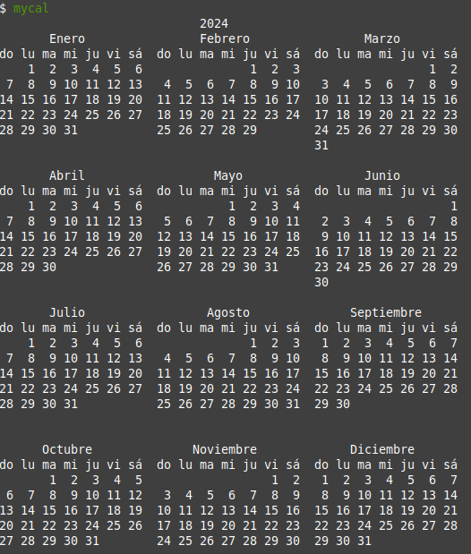

La respuesta más simple a la pregunta "¿Qué es un comando?" es que un comando es un programa de software que cuando se ejecuta en la línea de comandos, realiza una acción en el equipo.

Cuando tomas en cuenta un comando utilizando esta definición, en realidad estás tomando en cuenta lo que sucede al ejecutar un comando. Cuando se escribe un comando, el sistema operativo ejecuta un proceso que puede leer una entrada, manipular datos y producir la salida. Desde esta perspectiva, un comando ejecuta un proceso en el sistema operativo, y entonces la computadora realiza un trabajo.

Sin embargo, un comando se puede ver desde una perspectiva diferente: desde su origen. La fuente es desde donde el comando "proviene" y hay varios orígenes diferentes de comandos dentro de shell de la CLI:

* **Comandos integrados en el shell** : Un buen ejemplo es el comando `cd` ya que es parte del bash shell. Cuando un usuario escribe el comando `cd`, el bash shell ya se está ejecutando y sabe cómo interpretar ese comando, sin requerir de ningún programa adicional para iniciarse.
* **Comandos que se almacenan en archivos que son buscados por el shell** : Si escribes un comando `ls`, entonces shell busca en los directorios que aparecen en la variable RUTA DE ACCESO (`PATH`) para tratar de encontrar un archivo llamado `ls` que puede ejecutar. Estos comandos se pueden ejecutar también escribiendo la ruta de acceso completa del comando.
* **Alias** : Un alias puede reemplazar un comando integrado, la función o un comando que se encuentra en un archivo. Los alias pueden ser útiles para la creación de nuevos comandos de funciones y comandos existentes.
* **Funciones** : Las funciones también pueden ser construidas usando los comandos existentes o crear nuevos comandos, reemplazar los comandos integrados en el shell o comandos almacenados en archivos. Los alias y las funciones normalmente se cargan desde los archivos de inicialización cuando se inicia el shell por primera vez, que veremos más adelante.


---
**Para considerar**

Aunque los alias serán tratados en detalle en una sección posterior, este ejemplo breve puede ser útil para entender el concepto de comandos. 

Un alias es esencialmente un apodo para otro comando o una serie de comandos. Por ejemplo, el comando de `cal 2014` muestra el calendario para el año 2014. Supongamos que acabes ejecutando este comando a menudo. En lugar de ejecutar el comando completo cada vez, puedes crear un alias llamado `mycal` y ejecutar el alias como se muestra en el siguiente gráfico:

---

```bash
alias mycal="cal $(date +'%Y')"
```


