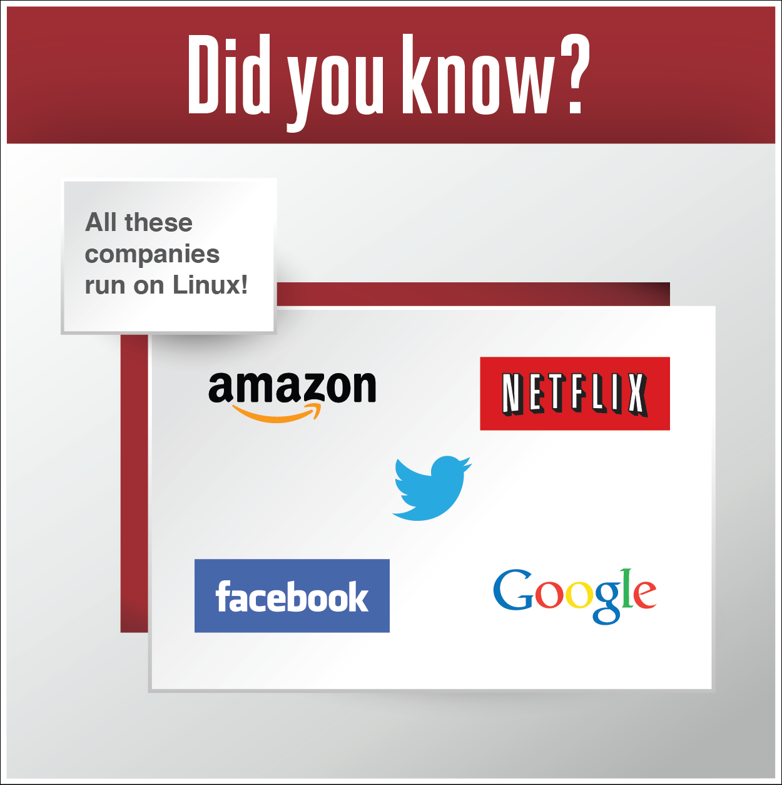

En este capítulo vamos a conocer varias herramientas y aplicaciones de código abierto. También vamos a hablar del software y concesión de licencias de código abierto.

**¿Lo sabía?** ¡Todas estas compañías ejecutan sobre Linux!
