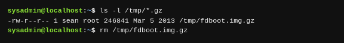

La historia del desarrollo de UNIX muestra una considerable superposición entre las habilidades de administración de sistemas y desarrollo de software. Las herramientas que te permiten administrar el sistema tienen funciones de lenguajes de programación tales como ciclos (loops), y algunos lenguajes de programación se utilizan extensivamente en la automatización de las tareas de administración de sistemas. Por lo tanto, uno debe considerar estas habilidades complementarias.

En el nivel básico, interactúan con un sistema Linux a través de un shell sin importar si te conectas al sistema de forma remota o desde un teclado. El trabajo de shell consiste en aceptar los comandos, como manipulación de archivos y aplicaciones de inicio y pasarlos al kernel de Linux para su ejecución. A continuación se muestra una interacción típica con la shell de Linux:

El usuario recibe un mensaje, que normalmente termina en un signo de dólar `$` para indicar una cuenta sin privilegios. Cualquier cosa antes del símbolo, en este caso `sysadmin@localhost:~`, es un indicador configurable que proporciona información extra al usuario. En la imagen anterior, `sysadmin` es el nombre del usuario actual, `localhost` es el nombre del servidor, y `~` es el directorio actual (en UNIX, el símbolo de tilde es una forma corta para el directorio home del usuario). Los comandos de Linux los trataremos con más detalle más adelante, pero para terminar la explicación, el primer comando muestra los archivos con el comando ls, recibe información sobre el archivo y luego elimina ese archivo con el comando `rm`.

El shell de Linux proporciona un rico lenguaje para iterar sobre los archivos y personalizar el entorno, todo sin salir del shell. Por ejemplo, es posible escribir una sola línea de comando que encuentra archivos con un contenido que corresponda a un cierto patrón, extrae la información del archivo, y luego copia la nueva información en un archivo nuevo.

Linux ofrece una variedad de shells para elegir, en su mayoría difieren en cómo y qué se puede modificar para requisitos particulares y la sintaxis del lenguaje “script” incorporado. Las dos familias principales son **Bourne shell** y **C shell** . Bourne shell recibió su nombre de su creador y C shell porque la sintaxis viene prestada del lenguaje C. Como ambos de estos shells fueron inventados en la década de 1970 existen versiones más modernas, el **Bourne Again Shell** (Bash) y **tcsh** (tee-cee-shell). Bash es el shell por defecto en la mayoría de los sistemas, aunque casi puedes estar seguro de que tcsh es disponible si lo prefieres.

Otras personas tomaron sus características favoritas de Bash y tcsh y han creado otros shells, como el **Korn shell** (ksh) y **zsh** . La elección de los shells es sobre todo personal. Si estás cómodo con Bash entonces puedes operar eficazmente en la mayoría de los sistemas Linux. Después de eso puedes buscar otras vías y probar nuevos shells para ver si ayudan a tu productividad.

Aún más dividida que la selección de los shells son las alternativas de los editores de texto. Un editor de texto se utiliza en la consola para editar archivos de configuración. Los dos campos principales son **vi** (o **vim** más moderno) y **emacs** . Ambos son herramientas extraordinariamente poderosas para editar archivos de texto, que se diferencian en el formato de los comandos y manera de escribir plugins para ellos. Los plugins podrían ser cualquier cosa desde el resaltado de sintaxis de proyectos de software hasta los calendarios integrados.

Ambos **vim** y **emacs** son complejos y tienen una curva de aprendizaje extensa. Esto no es útil si lo que necesitas es editar un pequeño archivo de texto simple. Por lo tanto **pico** y **nano** están disponibles en la mayoría de los sistemas (el último es un derivado del anterior) y ofrecen edición de texto muy básica.

Incluso si decides no usar **vi** , debes esforzarte a ganar cierta familiaridad básica porque el **vi** básico está en todos los sistemas Linux. Si vas a restaurar un sistema Linux dañado ejecutando el modo de recuperación de la distribución, seguramente tendrás un **vi** disponible.

Si tienes un sistema Linux necesitarás agregar, quitar y actualizar el software. En cierto momento esto significaba descargar el código fuente, configurarlo, construirlo y copiar los archivos en cada sistema. Afortunadamente, las distribuciones crearon paquetes, es decir copias comprimidas de la aplicación. Un administrador de paquetes se encarga de hacer el seguimiento de que archivos que pertenecen a que paquete, y aun descargando las actualizaciones desde un servidor remoto llamado repositorio. En los sistemas Debian las herramientas incluyen **dpkg** , **apt-get** y **apt-cache** . En los sistemas derivados de Red Hat utilizas **rpm** y **yum** . Veremos más de los paquetes más adelante.
