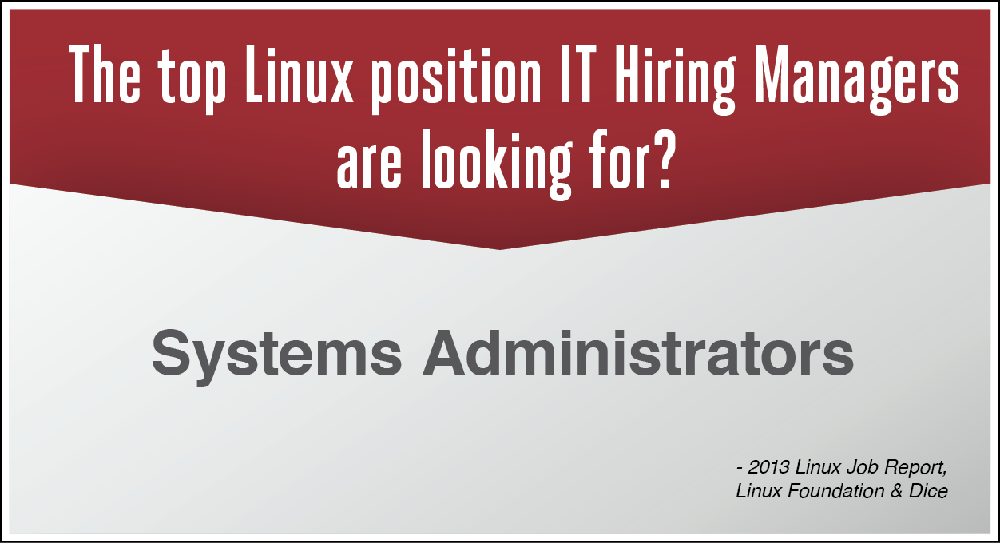

Antes de que te puedas convertir en un administrador eficaz de los sistemas Linux, debes saber utilizar Linux como tu escritorio y tener aptitudes con las habilidades básicas de la Tecnología de Información y Comunicación (TIC). No sólo eso te ayudará al tratar con usuarios, sino sumergiéndote en el Linux te ayudará a mejorar tus habilidades más rápidamente. Además, la vida de un administrador de sistemas es más que un trabajo en el servidor - ¡hay también correo electrónico y documentación para hacer!

¿Cuál es la mejor posición de empleo de Linux que los Gerentes de Reclutamiento de TI están buscando?

Administradores de Sistemas

- Reporte Laboral de Linux 2013, Linux Foundation & Dice
