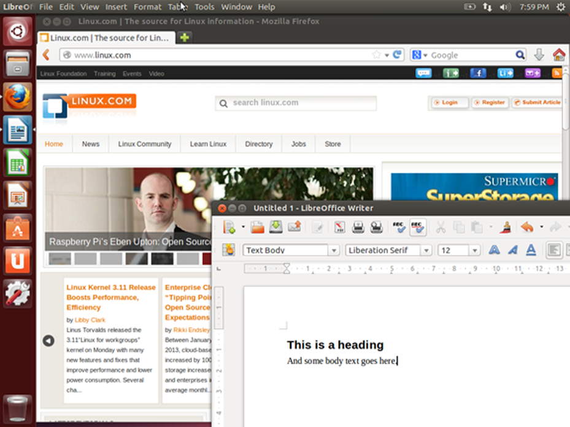
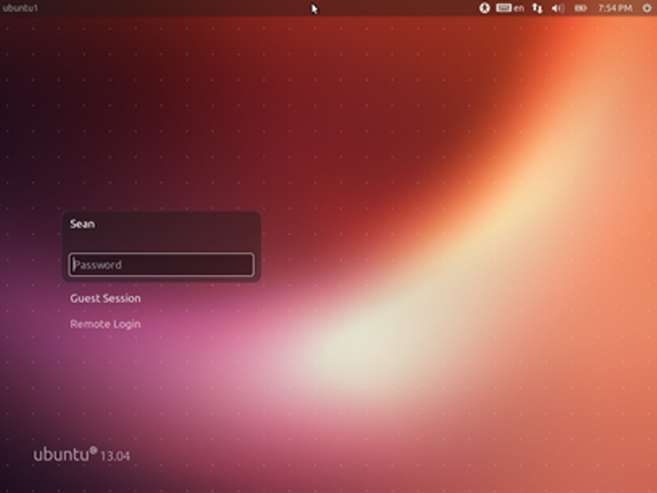
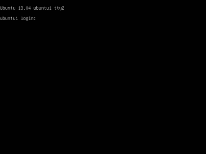
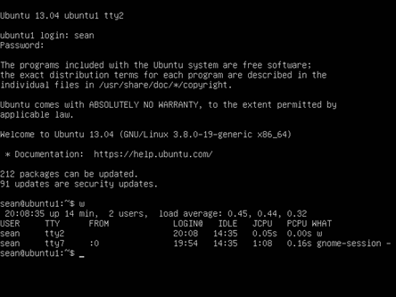

Linux puede usarse de dos maneras: en modo gráfico y modo no gráfico. En modo gráfico las aplicaciones corren en las ventanas que puedes cambiar el tamaño y mover. Tienes menús y herramientas que te ayudan a encontrar lo que buscas. Aquí es donde vas a usar un navegador web, tus herramientas de edición de gráficos y tu correo electrónico. Aquí vemos un ejemplo del escritorio gráfico, con una barra de menús de aplicaciones populares en la izquierda y un documento de LibreOffice editado con un navegador web en el fondo.

En modo gráfico puedes tener varios shells abiertos, que resulta muy útil cuando se están realizando tareas en múltiples equipos remotos. Incluso puedes iniciar la sesión con tu usuario y contraseña a través de una interfaz gráfica. En la siguiente figura se muestra un ejemplo de un inicio de sesión gráfico.

Después de iniciar la sesión pasarás al escritorio donde puedes cargar las aplicaciones. El modo no gráfico comienza con una sesión basada en texto que se muestra a continuación. Simplemente se te pedirá tu nombre de usuario y luego tu contraseña. Si el inicio de sesión tiene éxito pasarás directamente al shell.

En el modo no gráfico no hay ventanas para navegar. A pesar de esto tienes editores de texto, navegadores web y clientes de correo electrónico, pero son sólo de texto. De este modo UNIX empezó antes que los entornos gráficos fueran la norma. La mayoría de los servidores también se ejecutarán en este modo, ya que la gente no entra en ellos directamente, lo que hace que una interfaz gráfica sea un desperdicio de recursos. Aquí hay un ejemplo de la pantalla que se puede ver después de iniciar la sesión.

Puedes ver el mensaje original para entrar en la parte superior con el texto más reciente añadido a continuación. Durante el inicio de sesión podrías ver algunos mensajes, llamados el mensaje del día (MOTD), que es una oportunidad para que el administrador de sistemas para pasar información a los usuarios. El MOTD es el símbolo del sistema. En el ejemplo anterior, el usuario introdujo el comando w que muestra quién está conectado. De manera que son introducidos y procesados los comandos nuevos, la ventana se desplaza hacia arriba y el texto más antiguo se pierde en la parte superior. La terminal es responsable de mantener cualquier historia, tal como para permitir al usuario desplazarse hacia arriba y ver los comandos introducidos. En cuanto a Linux, lo que está en la pantalla es todo lo que hay. No hay nada para navegar.
