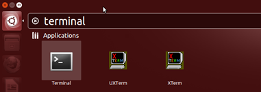

La línea de comandos es una entrada de texto simple, que te permite ingresar cualquier cosa, desde un comando de una sola palabra hasta scripts complicados. Si inicias la sesión a través de modo de texto te encuentras inmediatamente en la consola. Si inicias la sesión de forma gráfica, entonces necesitarás iniciar un shell gráfico, que es solo una consola de texto con una ventana a su alrededor para que puedas cambiar su tamaño y posición.

Cada escritorio de Linux es diferente, por lo que tienes que buscar en tu menú una opción llamada **terminal** o **x-term** . Las dos son shells gráficos, diferenciadas sobre todo en aspectos más que funcionalidad. Si tienes una herramienta de búsqueda como Ubuntu Dash, puedes buscar un **terminal** como se muestra aquí.

Estas herramientas te permiten buscar rápidamente en tu sistema exactamente lo que quieres ejecutar en lugar de perderte en los menús.
