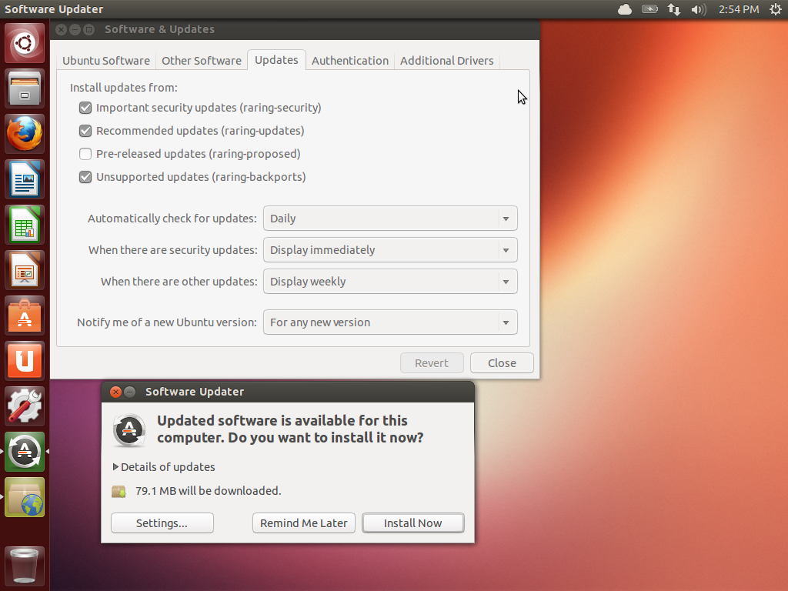
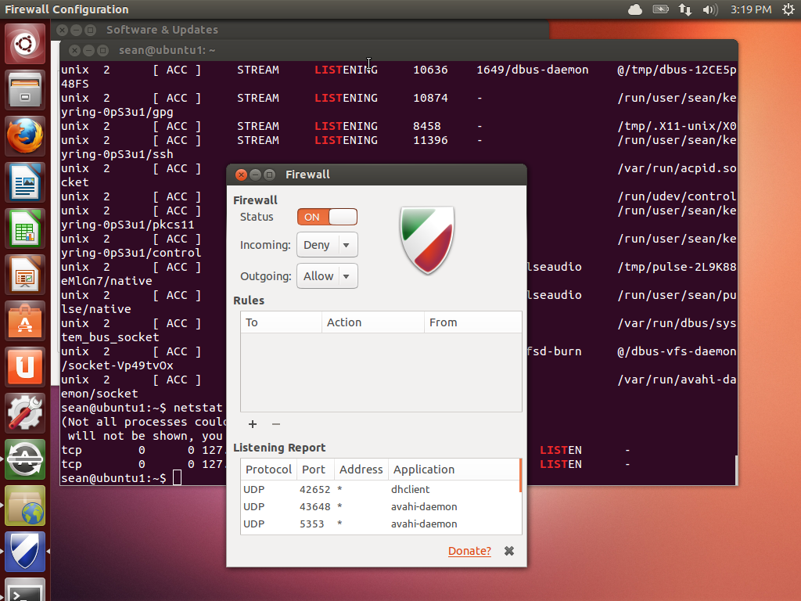

A Linux no le importa si estás en el teclado de un equipo o conectado a través de Internet, por lo que querrás tomar algunas precauciones básicas para asegurarte de que tus datos están a salvo.

Lo más fácil es utilizar una buena y única contraseña donde quiera que vayas, sobre todo en tu máquina local. Una buena contraseña tiene al menos 10 caracteres y contiene una mezcla de números y letras (tanto mayúsculas y minúsculas) y símbolos especiales. Utiliza un paquete como [**KeePassX**](http://www.keepassx.org/) para generar contraseñas, ya que luego sólo necesitas tener una contraseña de inicio de sesión a tu equipo y una contraseña para abrir el archivo de KeePassX.

Después de eso, crea periódicamente un punto de comprobación de actualizaciones. A continuación, te mostraremos la configuración de actualización de software Ubuntu, que está disponible en el menú de **Configuración**.

En la parte superior, se puede ver que el sistema está configurado para buscar actualizaciones de forma diaria. Si hay actualizaciones relacionadas con la seguridad, entonces se te pedirá que las instales inmediatamente. De lo contrario, recibirás las actualizaciones en lotes cada semana. En la parte inferior de la pantalla puedes ver el cuadro de diálogo que aparece cuando hay actualizaciones disponibles. Todo lo que tienes que hacer es hacer clic en **Instalar ahora** y tu equipo se actualizará!

Por último, tienes que proteger tu equipo de aceptar conexiones entrantes. Firewall es un dispositivo que filtra el tráfico de red y Linux tiene uno integrado. Si usas Ubuntu, **gufw** es una interfaz gráfica para "Uncomplicated firewall" de Ubuntu.

Simplemente cambiando el estado a "on" se bloquea todo el tráfico que llega a tu equipo, a menos que lo hayas iniciado tú mismo. De manera selectiva puedes permitir que entren algunas cosas haciendo clic en el signo más.

Bajo el capó estás usando iptables que es el sistema firewall integrado. En lugar de introducir comandos iptables complicados, usas un GUI. Mientras que este GUI te permite construir una política efectiva de un escritorio, éste apenas araña la superficie de lo que se puede hacer con iptables.
