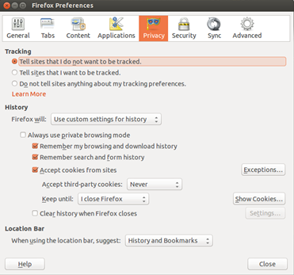

Cuando navegas por Internet, dejas una huella digital. Mucha de esta información viene ignorada, pero alguna viene reunida para recopilar estadísticas de publicidad y otra puede ser utilizada para propósitos maliciosos.

Como regla general, no deberías confiar en los sitios con los que interactúas. Usa contraseñas diferentes en cada sitio de Internet para que si tal sitio web estuviera hackeado, la contraseña no podría utilizarse para obtener acceso a otros sitios. Usando anteriormente mencionado KeePassX es la forma más fácil de hacerlo. De la misma forma, limita la información que proporcionas a los sitios, sólo lo imprescindible. Mientras que dar el nombre de tu madre y fecha de nacimiento podría ayudarte a desbloquear tus credenciales para la red social en caso de que pierdas tu contraseña, la misma información puede utilizarse para suplantar la identidad de tu banco.

Las cookies son el mecanismo principal que los sitios web utilizan para darte seguimiento. A veces este seguimiento es bueno, por ejemplo para dar seguimiento de lo que está en tu cesta de compras o para mantenerte conectado cuando regreses al sitio.

Cuando navegas por la web, un servidor web puede devolver la cookie que es un pequeño trozo de texto junto con la página web. Tu navegador lo almacena y envía con cada solicitud al mismo sitio. No envías cookies para ejemplo.com a sitios en ejemplo.org.

Sin embargo, muchos sitios han incrustado scripts que provienen de terceros, como un mensaje emergente de anuncio o un píxel de analítica. Si ejemplo.com y ejemplo.org tienen un píxel de analítica, por ejemplo de un anunciante, entonces esa misma cookie se enviará al navegar por ambos sitios. El anunciante se entera entonces que has visitado ejemplo.com y ejemplo.org.

Con un alcance suficientemente amplio, como los "Likes" y botones parecidos, un sitio web puede obtener un entendimiento de cuáles sitios web visitas y averiguar tus intereses y datos demográficos.

Existen diversas estrategias para tratar este asunto. Uno es ignorarlo. La otra es limitar los píxeles de seguimiento que aceptas, ya sea por bloqueo completo o vaciarlos periódicamente. A continuación abajo se muestra la configuración de cookies para Firefox. En la parte superior, verás que el usuario ha optado que Firefox no de permiso al sitio para el seguimiento. Esta es una etiqueta voluntaria enviada en la petición que algunos sitios distinguirán. A continuación, el navegador recibe una instrucción de no recordar nunca las cookies de terceros y eliminar cookies regulares (por ejemplo, desde el sitio navegando) después de haber cerrado el Firefox.

Afinando la configuración de privacidad puede hacerte más anónimo en Internet, pero también puede causar problemas con algunos sitios que dependen de cookies de terceros. Si esto sucede, probablemente tengas que permitir explícitamente que se guarden algunas cookies.

Aquí también tendrás la posibilidad de olvidar el historial de búsqueda o no seguirlo. Con el historial de búsqueda eliminado no habrá ningún registro en el equipo local de los sitios que hayas visitado.

Si te preocupa mucho ser anónimo en Internet, puedes descargar y utilizar el [**Navegador Tor**](https://www.torproject.org/projects/torbrowser.html.en). Tor es el nombre corto para "The Onion Router" que es una red de servidores públicamente ejecutados que rebotan tu tráfico para ocultar el origen. El navegador que viene con el paquete es una versión básica que no ejecuta ni siquiera las secuencias de comandos, por lo que algunos sitios probablemente no funcionarán correctamente. Sin embargo, es la mejor manera de ocultar tu identidad si es lo que deseas hacer.
