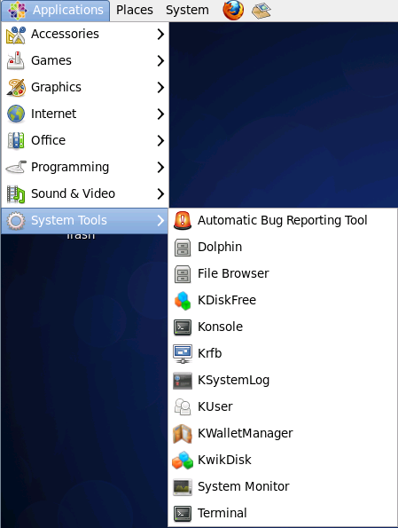

Hay muchas maneras de acceder a la ventana de la terminal. Algunos sistemas arrancarán directamente a la terminal. Este suele ser el caso de los servidores, ya que una interfaz gráfica de usuario (GUI) puede requerir muchos recursos que no son necesarios para realizar operaciones basadas en servidores.

Un buen ejemplo de un servidor que no requiere una GUI es un servidor web. Los servidores web deben correr tan rápido como sea posible y una GUI sólo haría lento el sistema.

En los sistemas que arrancan con una GUI, hay comúnmente dos formas de acceder a una terminal, una terminal basado en GUI y un terminal virtual:

* Una terminal de GUI es un programa dentro del entorno de una GUI que emula la ventana de la terminal. Las terminales de la GUI pueden accederse a través del sistema de menú. Por ejemplo, en una máquina CentOS, puedes hacer clic en **Applications** (o «Aplicaciones» en español) en la barra de menús, luego en **System Tools >** (o «Herramientas de Sistema») y, finalmente, en **Terminal**:

    

* Una terminal virtual puede ejecutarse al mismo tiempo que una GUI, pero requiere que el usuario se conecte o inicie sesión a través de la terminal virtual antes de que pueda ejecutar los comandos (como lo haría antes de acceder a la interfaz GUI). La mayoría de los sistemas tienen múltiples terminales virtuales que se pueden acceder pulsando una combinación de teclas, por ejemplo: **Ctrl-Alt-F1**

!!! Nota

    En las máquinas virtuales puede que las terminales virtuales no estén disponibles.

[//]: # (fin-nota)