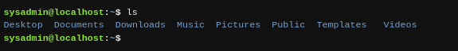
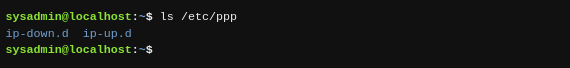
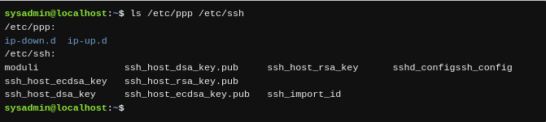

Muchos comandos se pueden utilizar por sí mismos sin más entradas. Algunos comandos requieren entradas adicionales para funcionar correctamente. Esta entrada adicional viene en dos formas: opciones y argumentos.

El formato típico de un comando es el siguiente:

```
comando [opciones] [argumentos]
```

Las opciones se utilizan para modificar el comportamiento básico de un comando y los argumentos se utilizan para proporcionar información adicional (tal como un nombre de archivo o un nombre de usuario). Cada opción y argumento vienen normalmente separados por un espacio, aunque las opciones pueden a menudo ser combinadas.

---

Recuerda que Linux es sensible a mayúsculas y minúsculas. Comandos, opciones, argumentos, variables y nombres de archivos deben introducirse exactamente como se muestra.

---

El comando `ls` proporciona ejemplos útiles. Por sí mismo, el comando `ls` listará los archivos y directorios contenidos en el directorio de trabajo actual:



---

Sobre el comando `ls` hablaremos en detalle en un capítulo posterior. El propósito de introducir este comando ahora, es demostrar cómo los argumentos y las opciones funcionan. En este punto no te debes preocupar de lo que es la salida del comando, más bien centrarte en comprender en qué es un argumento y una opción.

---

Un argumento lo puedes pasar también al comando `ls` para especificar contenido de qué directorio hay que listar. Por ejemplo, el comando `ls /etc/ppp` listará el contenido del directorio `/etc/ppp` en lugar del directorio actual:



Puesto que el comando `ls` acepta múltiples argumentos, puede listar el contenido de varios directorios a la vez, introduciendo el comando `ls /etc/ppp /etc/ssh`:


