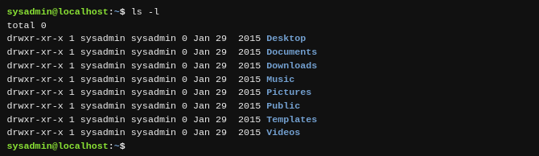
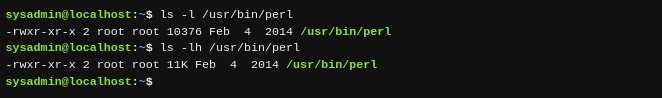
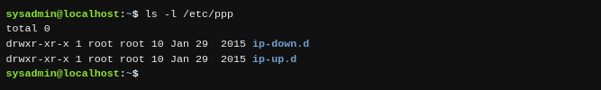

Las opciones pueden utilizarse con comandos para ampliar o modificar el comportamiento de un comando. Las opciones son a menudo de una letra; sin embargo, a veces serán "palabras". Por lo general, los comandos viejos utilizan una letra, mientras los comandos nuevos utilizan palabras completas para las opciones. Opciones de una letra son precedidas por un único guión `-`. Opciones de palabra completa son precedidas por dos guiones `--`.

Por ejemplo, puedes utilizar la opción `-l` con el comando `ls` para ver más información sobre los archivos que se listan. El comando `ls -l` lista los archivos contenidos dentro del directorio actual y proporciona información adicional, tal como los permisos, el tamaño del archivo y otra información:

En la mayoría de los casos, las opciones pueden utilizarse conjuntamente con otras opciones. Por ejemplo, los comandos `ls -l -h` o `ls -lh` listarán los archivos con sus detalles, pero se mostrará el tamaño de los archivos en formato de legibilidad humana en lugar del valor predeterminado (bytes):

Nota que el ejemplo anterior también demostró cómo se pueden combinar opciones de una letra: -lh . El orden de las opciones combinadas no es importante.

La opción `-h` también tiene la forma de una palabra completa: `--human-readable` (--legibilidad-humana).

Las opciones a menudo pueden utilizarse con un argumento. De hecho, algunas de las opciones requieren sus propios argumentos. Puedes utilizar los argumentos y las opciones con el comando `ls` para listar el contenido de otro directorio al ejecutar el comando `ls -l/etc/ppp`:

