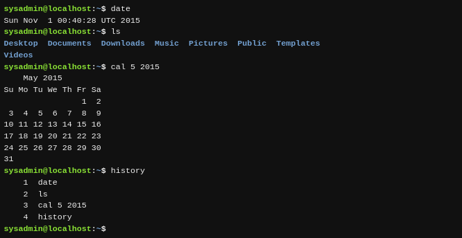
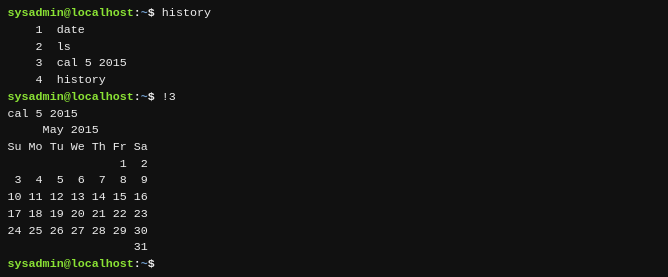

Al ejecutar un comando en una terminal, el comando se almacena en "history list" (o «lista de historial» en español). Esto está diseñado para que más adelante puedas ejecutar el mismo comando más fácilmente puesto que no necesitarás volver a introducir el comando entero.

Para ver la lista de historial de una terminal, utiliza el comando `history` (o «historial» en español):

Pulsando la tecla de **Flecha Hacia Arriba ↑** se mostrará el comando anterior en tu línea de prompt. Puedes presionar arriba repetidas veces para moverte a través del historial de comandos que hayas ejecutado. Presionando la tecla **Entrar** se ejecutará de nuevo el comando visualizado.

Cuando encuentres el comando que quieres ejecutar, puedes utilizar las teclas de **Flecha Hacia Izquierda ←** y **Flecha Hacia Derecha →** para colocar el cursor para edición. Otras teclas útiles para edición incluyen **Inicio** , **Fin** , **Retroceso** y **Suprimir** .

Si ves un comando que quieres ejecutar en la lista que haya generado el comando `history`, puedes ejecutar este comando introduciendo el signo de exclamación y luego el número al lado del comando, por ejemplo:

!3

!3
Algunos ejemplos adicionales del `history`:

| Ejemplo     | Significado                                                                |
| ------------- | ---------------------------------------------------------------------------- |
| `history 5` | Muestra los últimos cinco comandos de la lista del historial              |
| `!!`        | Ejecuta el último comando otra vez                                        |
| `!-5`       | Ejecuta el quinto comando desde la parte inferior de la lista de historial |
| `!ls`       | Ejecuta el comando`ls` más reciente                                       |
