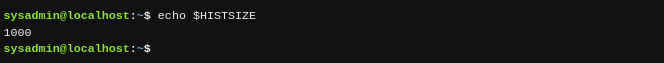
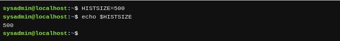

Una variable del shell BASH es una función que te permite a ti o al shell almacenar los datos. Esta información puede utilizarse para proporcionar información crítica del sistema o para cambiar el comportamiento del funcionamiento del shell BASH (u otros comandos).

Las variables reciben nombres y se almacenan temporalmente en la memoria. Al cerrar una ventana de la terminal o shell, todas las variables se pierden. Sin embargo, el sistema automáticamente recrea muchas de estas variables cuando se abre un nuevo shell.

Para mostrar el valor de una variable, puedes utilizar el comando `echo` (o «eco» en español). El comando `echo` se utiliza para mostrar la salida en la terminal; en el ejemplo siguiente, el comando mostrará el valor de la variable `HISTSIZE`:

La variable `HISTSIZE` define cuántos comandos anteriores se pueden almacenar en la lista del historial. Para mostrar el valor de la variable debes utilizar un carácter del signo de dólar `$` antes del nombre de la variable. Para modificar el valor de la variable, no se utiliza el carácter `$`:

---

Hay muchas variables del shell que están disponibles para el shell BASH, así como las variables que afectarán a los diferentes comandos de Linux. No todas las variables del shell están cubiertas por este capítulo, sin embargo, conforme vaya avanzando este curso hablaremos de más variables del shell.

---
