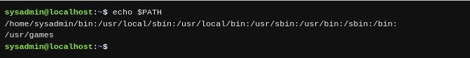
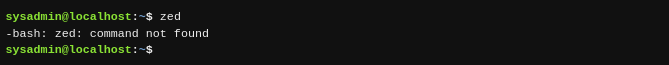
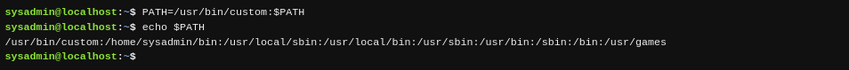

Una de las variables del shell BASH más importante que hay que entender es la variable `PATH`.

El término path (o «ruta» en español) se refiere a una lista que define en qué directorios el shell buscará los comandos. Si introduces un comando y recibes el error "command not found" (o «comando no encontrado» en español), es porque el shell BASH no pudo localizar un comando por ese nombre en cualquiera de los directorios en la ruta. El comando siguiente muestra la ruta del shell actual:

Basado en la anterior salida, cuando intentas ejecutar un comando, el shell primero busca el comando en el directorio `/home/sysadmin/bin`. Si el comando se encuentra en ese directorio, entonces se ejecuta. Si no es encontrado, el shell buscará en el directorio `/usr/local/sbin`.

Si el comando no se encuentra en ningún directorio listado en la variable `PATH`, entonces recibirás un error, `command not found`:

Si en tu sistema tienes instalado un software personalizado, puede que necesites modificar la ruta `PATH` para que sea más fácil ejecutar estos comandos. Por ejemplo, el siguiente comando agregará el directorio `/usr/bin/custom` a la variable `PATH`:

