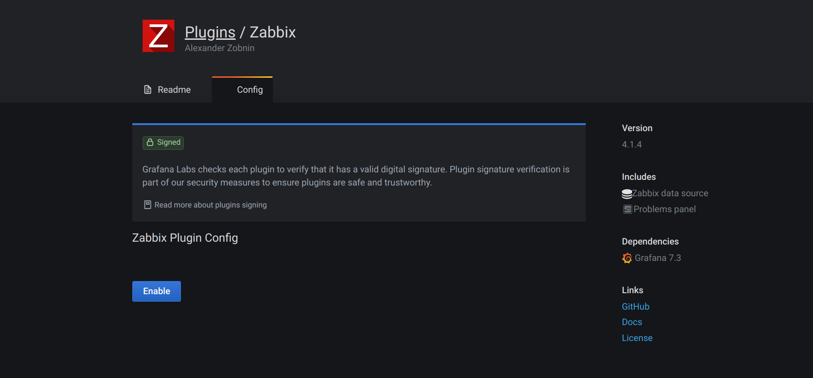
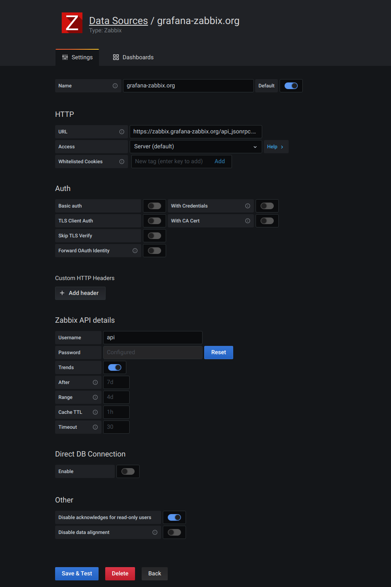

<p>
Grafana-Zabbix es un plugin para Grafana que permite visualizar datos de monitorización desde Zabbix y crear cuadros de mando para analizar métricas y monitorización en tiempo real. Los principales objetivos de este proyecto son ampliar las capacidades de Zabbix para la visualización de datos de monitorización y proporcionar una forma rápida y potente de crear cuadros de mando. Esto es posible gracias a las características de los plugins Grafana y Grafana-Zabbix.
</p>

## Recursos comunitarios, comentarios y apoyo

<p>
Este proyecto se inicia como un simple plugin para Grafana. Pero muchas características potentes y mejoras vienen de la comunidad. Así que no dudes en hacernos llegar tus comentarios y juntos mejoraremos esta herramienta.
</p>
<p>
Si tienes algún problema con Grafana o simplemente quieres una aclaración sobre una característica, hay varias maneras de obtener ayuda:
</p>

[Guía de resolución de problemas](https://grafana.com/docs/plugins/alexanderzobnin-zabbix-app/latest/configuration/troubleshooting/)

## Características destacadas

<p>
Grafana en pareja con el plugin Grafana-Zabbix permite crear grandes cuadros de mando. Hay algunas características:
</p>
* Funciones de gráficos enriquecidas
* Seleccione múltiples métricas mediante Regex 
* Cree cuadros de mando interactivos y reutilizables con variables de plantilla 
* Muestre eventos en gráficos con Anotaciones
* Transforme y dé forma a sus datos con funciones de procesamiento de métricas (Avg, Median, Min, Max, Multiply, Summarize, Time shift, Alias) 
* Mezcle métricas de múltiples fuentes de datos en el mismo cuadro de mando o panel 
* Cree alertas en 
* Grafana Visualice activadores con el panel Problemas
* Descubra y comparta cuadros de mando en la biblioteca oficial.

## Instalación

### Elección de la versión del plugin

Actualmente (en la versión 4.x.x) el plugin Grafana-Zabbix soporta las versiones 4.x y 5.x de Zabbix. Zabbix 3.x ya no está soportado. Generalmente, la última versión del plugin debería funcionar con la última versión de Grafana, pero si tienes algún problema de compatibilidad, intenta hacer un downgrade a la versión menor anterior de Grafana. También es útil reportar problemas de compatibilidad en [GitHub](https://github.com/grafana/grafana-zabbix/issues) (pero usa la búsqueda primero para evitar duplicar problemas).

### Uso de la herramienta graphana-cli

Obtener la lista de plugins disponibles

```bash
grafana-cli plugins list-remote
```

Instalar el plugin zabbix

```bash
grafana-cli plugins install alexanderzobnin-zabbix-app
```

Reiniciar grafana después de instalar plugins

```bash
systemctl restart grafana-server
```

Más información sobre la instalación de plugins en la [documentación de Grafana](https://grafana.com/docs/plugins/installation/)

**ADVERTENCIA** El único método de instalación fiable es grafana-cli. Cualquier otro método debe considerarse una solución provisional y no ofrece garantías de compatibilidad con versiones anteriores.

### De las versiones de github

A partir de la versión 4.0, cada versión del plugin en GitHub contiene el plugin empaquetado. Para instalarlo, vaya a la página de [versiones](https://github.com/grafana/grafana-zabbix/releases), elija la versión que desea obtener y haga clic en Activos. El plugin se empaquetará en un archivo zip con el nombre alexanderzobnin-zabbix-app-x.x.x.zip. Descárguelo, descomprímalo en el directorio de plugins de Grafana y reinicie el servidor Grafana. Cada paquete de plugins contiene una [firma digita](https://grafana.com/docs/grafana/latest/plugins/plugin-signatures/) que permite a Grafana verificar que el plugin ha sido publicado por su propietario y que los archivos no han sido modificados.

**Nota**: desde la versión 4.0 del plugin, grafana-cli descarga el plugin desde GitHub. Así que descargar manualmente el paquete del plugin, se obtiene el mismo paquete que a través de grafana-cli.

### Construir a partir de fuentes

Si desea crear un paquete usted mismo o contribuir, lea las [instrucciones de creación](https://grafana.com/docs/plugins/alexanderzobnin-zabbix-app/latest/installation/building-from-sources).

## Configuración

### Activar plugin

Ve a los plugins en el panel lateral de Grafana, selecciona la pestaña Apps, luego selecciona Zabbix, abre la pestaña Config y habilita el plugin.



### Configurar la fuente de datos Zabbix

Después de habilitar el plugin puede añadir la fuente de datos Zabbix.

Para añadir una nueva fuente de datos Zabbix, abra Fuentes de datos en el panel lateral, haga clic en Añadir fuente de datos y seleccione Zabbix en la lista desplegable.




### Configuración HTTP
* **URL**: establece la url de la API de Zabbix (ruta completa con api_jsonrpc.php).
* **Access**: Configurar como Servidor (por defecto).
* **Http Auth**: Configurar si utiliza autenticación 
proxy
    - **Basic Auth**:
    - **With Credentials**:

### Detalles de la API de Zabbix
* **Nombre de usuario** y **contraseña**: configure el inicio de sesión para acceder a la API de Zabbix. Compruebe también los permisos de usuario en Zabbix si no puede obtener ningún grupo ni host en Grafana.

* **Trends**: activar si utiliza Zabbix 3.x o posterior. Esta opción está estrictamente recomendada para mostrar periodos de tiempo largos (más de unos pocos días, dependiendo del intervalo de actualización de tu elemento en Zabbix), porque unos pocos días de historial de elementos contienen toneladas de puntos. El uso de tendencias aumentará el rendimiento de Grafana.

* **After**: Tiempo tras el cual se utilizarán las tendencias. La mejor práctica es ajustar este valor al periodo de almacenamiento de su historial (7d, 30d, etc). Por defecto es 7d (7 días). Puede establecer la hora en formato Grafana. Los especificadores de hora válidos son:
    * h - Horas.
    * d - Dias.
    * M - Meses.
* **Rage**: Amplitud del intervalo de tiempo a partir del cual se utilizarán las tendencias en lugar del historial. Es mejor establecer este valor entre 4 y 7 días para evitar cargar una gran cantidad de datos históricos. Por defecto es 4 días.

* **Cache TTL**: El plugin cachea algunas peticiones api para incrementar el rendimiento. Ajuste este valor a la duración de caché deseada (esta opción afecta a datos como la lista de elementos).

* **Timeout**: Tiempo de espera de la conexión Zabbix en segundos. Por defecto es 30.

### Conexión directa a base de datos

