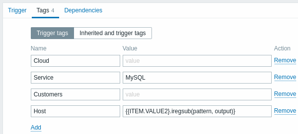
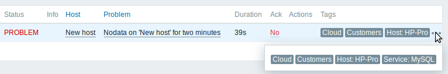

# 6 Tagging

## Visión general

Hay una opción para etiquetar varias entidades en Zabbix. Se pueden definir Tags para:

* templates
* hosts
* items
* web scenarios
* triggers
* services
* template items and triggers
* host, item and trigger prototypes

Las tags tienen varios usos, sobre todo para marcar eventos. Si las entidades están etiquetadas, los nuevos eventos correspondientes se marcan en consecuencia:

* Con templates etiquetados: se marcará cualquier problema de host creado por entidades relevantes (items, triggers, etc.) a partir de este template.
* Con hosts etiquetados - cualquier problema del host será marcado
* Con ítems etiquetados, web escenarios - cualquier dato/problema de este ítem o web escenario será marcado

Un evento problemático hereda todas las etiquetas de toda la cadena de plantillas, hosts, ítems, web escenarios, triggers. Las combinaciones etiqueta:valor completamente idénticas (después de las macros resueltas) se fusionan en una en lugar de duplicarse, al marcar el evento.

Disponer de tags de eventos personalizadas permite una mayor flexibilidad. Es importante destacar que los eventos pueden [correlacionarse](https://www.zabbix.com/documentation/6.0/en/manual/config/event_correlation) basándose en las tags de eventos. En otros usos, se pueden definir acciones basadas en eventos tags. Los problemas de los elementos pueden agruparse en función de las tags. Las tags de problemas también pueden utilizarse para asignar problemas a [servicios](https://www.zabbix.com/documentation/6.0/en/manual/it_services/service_tree#problem-tags).

El etiquetado se realiza como un par de nombre de etiqueta y valor. Puede utilizar sólo el nombre o emparejarlo con un valor:

MySQL, Service:MySQL, Services, Services:Customer, Applications, Application:Java, Priority:High

Una entidad (template, host, ítem, web escenario, trigger o event) puede ser etiquetada con el mismo nombre, pero con valores diferentes - estas tags no serán consideradas "duplicadas". Del mismo modo, una tag sin valor y la misma tag con valor pueden utilizarse simultáneamente.

## Casos prácticos

Algunos casos de uso de esta funcionalidad son los siguientes:

1. Marcar eventos trigger en el frontend

   * Defina una etiqueta en el nivel de activación, por ejemplo scope:performance;
   * Todos los problemas creados por este trigger se marcarán con esta tag.
2. Marcar todos los problemas heredados del template:

   * Defina una etiqueta a nivel de plantilla, por ejemplo target:MySQL;
   * Todos los problemas de host creados por disparadores de esta plantilla se marcarán con esta etiqueta.
3. Marcar todos los problemas del host:

   * Define una etiqueta a nivel de host, por ejemplo service:Jira;
   * Todos los problemas de los desencadenantes del host se marcarán con esta etiqueta.
4. Elementos relacionados con el grupo

   * Defina una etiqueta a nivel de artículo, por ejemplo component:cpu;
   * En la sección Últimos datos, utilice el filtro de etiquetas para ver todos los elementos etiquetados como component:cpu.
5. Identificar problemas en un archivo de registro y cerrarlos por separado

   * Defina etiquetas en el activador de registro que identificarán eventos utilizando la extracción de valores mediante la macro {{ITEM.VALUE<N>}.regsub()};
   * En la configuración del disparador, establezca el modo de generación de eventos de problemas múltiples;
   * En la configuración del activador, utilice la [correlación de eventos](https://www.zabbix.com/documentation/6.0/en/manual/config/event_correlation): seleccione la opción de que el evento OK cierre sólo los eventos coincidentes y elija la etiqueta para la coincidencia;
   * Ver los eventos problemáticos creados con una etiqueta y cerrados individualmente.
6. Utilícelo para filtrar notificaciones:

   * Defina etiquetas en el nivel de activación para marcar eventos por diferentes etiquetas;
   * Utilice el filtrado por etiquetas en las condiciones de acción para recibir notificaciones sólo de los eventos que coincidan con los datos de las etiquetas.
7. Utilizar la información extraída del valor del artículo como valor de la etiqueta

   * Utilice una macro {{ITEM.VALUE<N>}.regsub()} en el valor de etiqueta;
   * Consulte Valores de etiqueta en Supervisión → Problemas como datos extraídos del valor de elemento.
8. Identificar mejor los problemas en las notificaciones:

   * Definir etiquetas en el nivel de activación;
   * Utilizar una macro {EVENT.TAGS} en la notificación del problema;
   * Identificar más fácilmente a qué aplicación/servicio pertenece la notificación.
9. Simplifique las tareas de configuración utilizando etiquetas a nivel de plantilla:

   * Definir etiquetas a nivel de trigger de template;
   * Ver estas etiquetas en todos los trigger creados a partir de trigger de template.
10. Creación de disparadores con etiquetas de detección de bajo nivel (LLD)

    * Definir etiquetas en prototipos de disparador;
    * Utilizar macros LLD en el nombre o valor de la etiqueta;
    * Ver estas etiquetas en todos los disparadores creados a partir de prototipos de disparador.
11. Emparejar servicios utilizando [etiquetas de servicio](https://www.zabbix.com/documentation/6.0/en/manual/it_services/service_tree#service-tags):

    * Definir [acciones de servicio](https://www.zabbix.com/documentation/6.0/en/manual/it_services/service_actions#conditions) para servicios con etiquetas coincidentes;
    * Utilizar etiquetas de servicio para asignar un servicio a un SLA para [cálculos de SLA](https://www.zabbix.com/documentation/6.0/en/manual/it_services/sla#configuration).
12. Asignar servicios a problemas utilizando [etiquetas de problemas](https://www.zabbix.com/documentation/6.0/en/manual/it_services/service_tree#service-configuration):

    * En la configuración del servicio, especifique la [etiqueta del problema](https://www.zabbix.com/documentation/6.0/en/manual/it_services/service_tree#problem-tags), por ejemplo target:MySQL;
    * Los problemas con la etiqueta coincidente se correlacionarán automáticamente con el servicio;
    * El estado del servicio cambiará al estado del problema con la gravedad más alta.
13. Suprimir problemas cuando un host está en modo de mantenimiento:

    * Defina etiquetas en los [periodos de mantenimiento](https://www.zabbix.com/documentation/6.0/en/manual/maintenance#configuration) para suprimir sólo los problemas con etiquetas coincidentes.
14. Conceder acceso a grupos de usuarios:

    * Especifique etiquetas en la configuración del grupo de usuarios para permitir ver sólo los problemas con etiquetas coincidentes.

## Configuración

Las tags pueden introducirse en una pestaña específica, por ejemplo, en la configuración de trigger:

## Compatibilidad con macros

Las macros incorporadas y de usuario en las etiquetas se resuelven en el momento del evento. Hasta que se produzca el evento, estas macros se mostrarán en el frontend de Zabbix sin resolver. Las macros de descubrimiento de bajo nivel se resuelven durante el proceso de descubrimiento.

Las siguientes macros pueden utilizarse en las etiquetas de activación:

* Se pueden utilizar las macros {ITEM.VALUE}, {ITEM.LASTVALUE}, {HOST.HOST}, {HOST.NAME}, {HOST.CONN}, {HOST.DNS}, {HOST.IP}, {HOST.PORT} y  {HOST.ID} para rellenar el nombre o el valor de la etiqueta.
* Las macros {INVENTORY.*} pueden utilizarse para hacer referencia a valores de inventario de host de uno o varios hosts en una expresión de activación. Se admiten macros de usuario y macros de usuario con contexto para la etiqueta nombre/valor; el contexto puede incluir macros de descubrimiento de bajo nivel.
* Se pueden utilizar macros de descubrimiento de bajo nivel para el nombre/valor de la etiqueta en los prototipos de activación.

Las siguientes macros pueden utilizarse en las notificaciones basadas en trigger:

* Las macros {EVENT.TAGS} y {EVENT.RECOVERY.TAGS} se resolverán con una lista separada por comas de etiquetas de eventos o etiquetas de eventos de recuperación.
* Las macros {EVENT.TAGSJSON} y {EVENT.RECOVERY.TAGSJSON} se resolverán en una matriz JSON que contiene [objetos](https://www.zabbix.com/documentation/6.0/en/manual/api/reference/event/object#event-tag) de etiqueta de evento u objetos de etiqueta de evento de recuperación.

Las siguientes macros pueden utilizarse en las etiquetas de plantilla, host, elemento y escenario web:

* Macros {HOST.HOST}, {HOST.NAME}, {HOST.CONN}, {HOST.DNS}, {HOST.IP}, {HOST.PORT} y {HOST.ID}
* [Macros](https://www.zabbix.com/documentation/6.0/en/manual/appendix/macros/supported_by_location) {INVENTORY.*}
* [Macros de usuario](https://www.zabbix.com/documentation/6.0/en/manual/config/macros/user_macros)
* Se pueden utilizar macros de descubrimiento de bajo nivel en las etiquetas de prototipos de artículos

Las siguientes macros pueden utilizarse en las etiquetas de prototipo de host:

* Macros {HOST.HOST}, {HOST.NAME}, {HOST.CONN}, {HOST.DNS}, {HOST.IP}, {HOST.PORT} y {HOST.ID}
* [Macros](https://www.zabbix.com/documentation/6.0/en/manual/appendix/macros/supported_by_location) {INVENTORY.*}
* [Macros de usuario](https://www.zabbix.com/documentation/6.0/en/manual/config/macros/user_macros)
* Las [macros de descubrimiento de bajo nivel](https://www.zabbix.com/documentation/6.0/en/manual/config/macros/lld_macros) se resolverán durante el proceso de descubrimiento y luego se añadirán al host descubierto

## Extracción de subcadenas en etiquetas de activación

Se admite la extracción de subcadenas para rellenar el nombre de etiqueta o el valor de etiqueta, utilizando una [función](https://www.zabbix.com/documentation/6.0/en/manual/config/macros/macro_functions) de macro - aplicando una expresión regular al valor obtenido por la macro {ITEM.VALUE}, {ITEM.LASTVALUE} o una macro de descubrimiento de bajo nivel. Por ejemplo:

  {{ITEM.VALUE}.regsub(pattern, output)}
  {{ITEM.VALUE}.iregsub(pattern, output)}
   
  {{#LLDMACRO}.regsub(pattern, output)}
  {{#LLDMACRO}.iregsub(pattern, output)}
## Visualización de etiquetas de eventos

El etiquetado, si se ha definido, se puede ver con los nuevos eventos en:

* Monitoring → Problems
* Monitoring → Problems → Event details
* Monitoring → Dashboard → Problems widget

Sólo pueden mostrarse las tres primeras etiquetas. Si hay más de tres entradas de etiquetas, se indica mediante tres puntos. Si pasa el ratón por encima de estos tres puntos, se mostrarán todas las entradas de etiquetas en una ventana emergente.

Tenga en cuenta que el orden en que se muestran las etiquetas se ve afectado por el filtrado de etiquetas y la opción Prioridad de visualización de etiquetas en el filtro de Supervisión → Problemas o el widget del panel Problemas.

