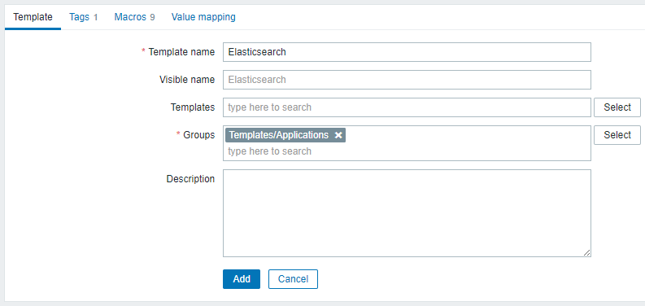
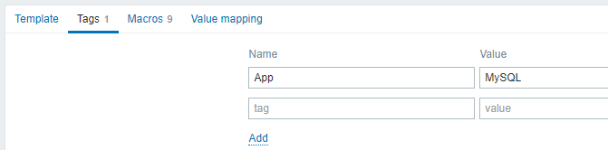
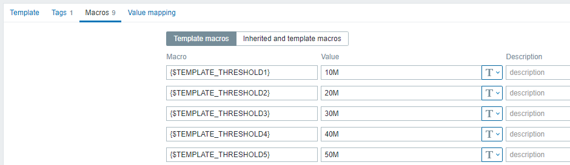
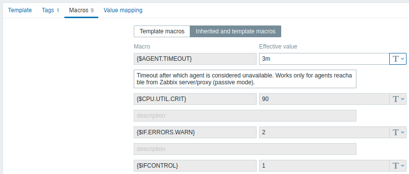

# 1 Configurar un template

## Visión general

Para configurar una plantilla, primero hay que crearla definiendo sus parámetros generales y, a continuación, añadirle entidades (elementos, activadores, gráficos, etc.).

## Crear una plantilla

Para crear una plantilla, haga lo siguiente:

* Ir Configuration → Templates
* Haga clic en Create template
* Editar template attributes

La pestaña **Template** contiene los atributos generales de la plantilla.

Todos los campos obligatorios están marcados con un asterisco rojo.

| Parámetro    | Descripción                                                                                                                                                                                                                                                                                                                                                                                                                                                                                                                                                                                                                                                                                                                                                                                                                                                                                                                                                                                                                                                                                                                                                         |
| --------------- | ---------------------------------------------------------------------------------------------------------------------------------------------------------------------------------------------------------------------------------------------------------------------------------------------------------------------------------------------------------------------------------------------------------------------------------------------------------------------------------------------------------------------------------------------------------------------------------------------------------------------------------------------------------------------------------------------------------------------------------------------------------------------------------------------------------------------------------------------------------------------------------------------------------------------------------------------------------------------------------------------------------------------------------------------------------------------------------------------------------------------------------------------------------------------- |
| Template name | Nombre único de la plantilla. Se permiten caracteres alfanuméricos, espacios, puntos, guiones y guiones bajos. Sin embargo, los espacios iniciales y finales no están permitidos.                                                                                                                                                                                                                                                                                                                                                                                                                                                                                                                                                                                                                                                                                                                                                                                                                                                                                                                                                                                 |
| Visible name  | Si estableces este nombre, será el visible en listas, mapas, etc.                                                                                                                                                                                                                                                                                                                                                                                                                                                                                                                                                                                                                                                                                                                                                                                                                                                                                                                                                                                                                                                                                                   |
| Templates     | Vincule una o más plantillas "anidadas" a esta plantilla. Todas las entidades (elementos, activadores, gráficos, etc.) se heredarán de las plantillas vinculadas. Para vincular una nueva plantilla, empiece a escribir el nombre de la plantilla en el campo Plantillas. Aparecerá una lista de plantillas coincidentes; desplácese hacia abajo para seleccionar. También puede hacer clic en Seleccionar junto al campo Plantillas; a continuación, seleccione primero el grupo de hosts haciendo clic en Seleccionar junto al campo Grupos de hosts; marque la casilla de verificación situada delante de una o varias plantillas de la lista que se muestra a continuación; haga clic en Seleccionar. La(s) plantilla(s) seleccionada(s) en el campo Plantillas se vinculará(n) al host cuando se guarde o actualice el formulario de configuración del host. Para desvincular una plantilla, utilice una de las dos opciones del bloque Plantillas: Desvincular: desvincula la plantilla, pero conserva sus elementos, activadores y gráficos Desvincular y borrar: desvincula la plantilla y elimina todos sus elementos, activadores y gráficos. |
| Groups        | Grupos de hosts/plantillas a los que pertenece la plantilla.                                                                                                                                                                                                                                                                                                                                                                                                                                                                                                                                                                                                                                                                                                                                                                                                                                                                                                                                                                                                                                                                                                         |

La pestaña Tags permite definir [Tags](/00.Blog/Zabbix/V6/Documentacion/07.Configuracion/06.Tagging/README.md) a nivel de plantilla. Todos los problemas de hosts vinculados a esta plantilla se etiquetarán con los valores introducidos aquí.

Las macros de usuario, {INVENTORY.*}, {HOST.HOST}, {HOST.NAME}, {HOST.CONN}, {HOST.DNS}, {HOST.IP}, {HOST.PORT} y {HOST.ID} son compatibles con las etiquetas.

La pestaña Macros permite definir [macros de usuario](https://www.zabbix.com/documentation/6.0/en/manual/config/macros/user_macros) a nivel de plantilla como pares nombre-valor. Tenga en cuenta que los valores de las macros pueden mantenerse como texto sin formato, texto secreto o secreto de bóveda. También es posible añadir una descripción.

También puede ver aquí las macros de las plantillas vinculadas y las macros globales si selecciona la opción Macros heredadas y de plantilla. Ahí es donde se muestran todas las macros de usuario definidas para la plantilla con el valor al que se resuelven, así como su origen.

Para mayor comodidad, se proporcionan enlaces a las plantillas respectivas y a la configuración global de macros. También es posible editar una plantilla anidada/macro global en el nivel de plantilla, creando efectivamente una copia de la macro en la plantilla.

La pestaña **Value mapping** permite configurar una representación amigable de los datos de los elementos en [Value mapping](https://www.zabbix.com/documentation/6.0/en/manual/config/items/mapping).

Botones:

| Botón           | Descripción                                                                                                                                                                                                                |
| ------------------ | ----------------------------------------------------------------------------------------------------------------------------------------------------------------------------------------------------------------------------- |
| Add              | Añada la plantilla. La plantilla añadida debería aparecer en la lista.                                                                                                                                                   |
| Updte            | Actualiza las propiedades de una plantilla existente.                                                                                                                                                                       |
| Clone            | Crea otra plantilla basada en las propiedades de la plantilla actual, incluidas las entidades (elementos, activadores, etc.) heredadas de las plantillas vinculadas.                                                        |
| Full Clone       | Crea otra plantilla basándose en las propiedades de la plantilla actual, incluidas las entidades (elementos, activadores, etc.) tanto heredadas de plantillas vinculadas como directamente adjuntas a la plantilla actual. |
| Delete           | Elimina la plantilla; las entidades de la plantilla (elementos, activadores, etc.) permanecen con los hosts vinculados. |
| Delete and Clear | Elimina la plantilla y todas sus entidades de los hosts vinculados.                                                                                                                                                         |
|Cancel                  | 	Cancelar la edición de las propiedades de la plantilla.  |

Una vez creada la plantilla, es hora de añadirle algunas entidades.

> **_ATENCIÓN:_**  Los Items deben añadirse primero a una plantilla. Los Triggers y los graphs no pueden añadirse sin el elemento correspondiente.

## Añadir Adding items, triggers, graphs
Hay dos formas de añadir items a la template:

1. Para crear nuevos items, siga las directrices para [Crear un elemento](https://www.zabbix.com/documentation/6.0/en/manual/config/items/items).
2. Para añadir items existentes al template:
    * Vaya a onfiguration → Hosts (or Templates).
    * Haga clic en *Items* en la fila del host/template deseado.
    * Marque las casillas de verificación de los items que desee añadir a la Templates
    * Haga clic en *Copiar* debajo de la lista de items
    * Seleccione el template (o grupo de template) en la que desea copiar los items y haga clic en Copiar. Todos los items seleccionados se copiarán en la template.

La adición de triggers y graphs se realiza de forma similar (desde la lista de triggers y graphs respectivamente), de nuevo, teniendo en cuenta que sólo pueden añadirse si primero se añaden los items requeridos.

## Añadiendo dashboards
Para añadir una dashboard a un template ir a Configuration → Template y haga lo siguiente:

> **Atención**: Los widgets que se pueden incluir en un template son: Clock, Graph (classic), Graph prototype, Item value, Plain text, URL..

> **Nota**: Para obtener más información sobre el acceso a los dashboards de host creados a partir de dashboards de template, consulte la sección [de dashboards de host](https://www.zabbix.com/documentation/6.0/en/manual/config/visualization/host_screens#accessing-host-dashboards).

## Configuración de las low-level discovery rules
Consulte la sección de [low-level discovery](https://www.zabbix.com/documentation/6.0/en/manual/discovery/low_level_discovery) del manual.

## Añadir web scenarios
Para añadir escenarios web a un template en Configuration → Templates, haga lo siguiente:

* Haga clic en Web en la fila del template
* Configure un web scenario siguiendo el método habitual de configuración de [web scenarios](https://www.zabbix.com/documentation/6.0/en/manual/web_monitoring#configuring-a-web-scenario)
