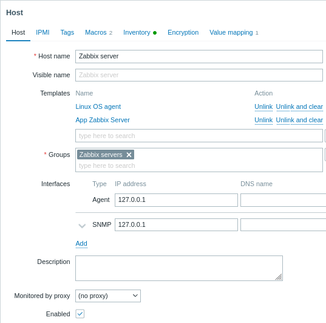

# 1 Configurar un host

## Visión general

Para configurar un host en el frontend de Zabbix, haga lo siguiente:

* Vaya a: Configuración → Hosts o Supervisión → Hosts Haga
* Clic en Crear host a la derecha (o en el nombre del host para editar un host existente)
* Introduzca los parámetros del host en el formulario

También puede utilizar los botones Clonar y Clonar completo en la forma de un host existente para crear un nuevo host. Al hacer clic en Clonar se conservarán todos los parámetros del anfitrión y la vinculación de templates (manteniendo todas las entidades de esas templates). La clonación completa conservará además las entidades directamente vinculadas (tags, items, triggers, graphs, low-level discovery rules and web scenarios).

**Nota**: Cuando se clona un host, conservará todas las entidades del template tal y como estaban originalmente en el template. Cualquier cambio realizado en esas entidades en el nivel de host existente (como el cambio del intervalo de item, la modificación de la expresión regular o la adición de prototypes a la regla de low-level discovery) no se clonará en el nuevo host, sino que se mantendrá como en el template.

## Configuración

La pestaña Host contiene los atributos generales del host:

****

Todos los campos obligatorios están marcados con un asterisco rojo.

| Parametero     | Descripción |
| ---------------- | ------------------ |
| *Host name*    | Introduzca un nombre de host único. Se permiten caracteres alfanuméricos, espacios, puntos, guiones y guiones bajos. Sin embargo, los espacios iniciales y finales no están permitidos. Nota: Con el agente Zabbix ejecutándose en el host que está configurando, el parámetro Hostname del[archivo de configuración](../21.Apendices/21.2.3.3.Agente_Zabbix_(UNIX).md) del agente debe tener el mismo valor que el nombre del host introducido aquí. El nombre del parámetro es necesario para procesar las [comprobaciones activas](../21.Apendices/21.4.3.Controles_de_agentes_pasivos_y_activos.md). |
| *Visible name* | Introduzca un nombre visible único para el host. Si establece este nombre, será el visible en listas, mapas, etc en lugar del nombre técnico del host. Este atributo es compatible con UTF-8.|
| Templates      | Vincula templates al host. Todas las entidades (items, triggers, graphs, etc.) se heredarán de la templates. Para vincular un nuevo template, empiece a escribir el nombre del template en el campo templates. Aparecerá una lista de templates coincidentes; desplácese hacia abajo para seleccionar. También puede hacer clic en Seleccionar junto al campo templates; a continuación, seleccione primero el grupo de hosts haciendo clic en Seleccionar junto al campo Grupos de hosts; marque la casilla de verificación situada delante de uno o varios templates de la lista que se muestra a continuación; haga clic en Seleccionar. Para desvincular un template, utilice una de las dos opciones del bloque templates: Desvincular: desvincula la templates, pero tems, triggers and graphs. Desvincular y borrar: desvincula la templates y elimina todos sus tems, triggers and graphs Los nombres de las templates que aparecen en la lista son enlaces en los que se puede hacer clic y que llevan al formulario de configuración de templates.   |
| Groups         | Seleccione los grupos de hosts a los que pertenece el host. Un anfitrión debe pertenecer al menos a un grupo de anfitriones. Se puede crear un nuevo grupo y vincularlo a un host escribiendo un nombre de grupo que no exista; el nuevo nombre aparecerá en una lista desplegable como "nuevo" entre paréntesis; al hacer clic en él, se añadirá al campo de selección.          |
| Interfaces               | Se admiten varios tipos de interfaz para un host: Agente, SNMP, JMX e IPMI. Por defecto no hay interfaces definidas. Para añadir un nuevo interfaz, haga clic en Añadir en el bloque Interfaces, seleccione el tipo de interfaz e introduzca IP/DNS, Conectar a e Información del puerto. Nota: Los interfaces que se utilizan en cualquier elemento no se pueden eliminar y el enlace Eliminar aparece en gris para ellos. Consulte [Configuración de la monitorización SNMP](7.2.3.2.Agente_SNMP.md) para obtener detalles adicionales sobre la configuración de un interfaz SNMP (v1, v2 y v3).                                  |
| 	IP address               | Dirección IP del host (opcional).                                  |
|                |                                   |
|                |                                   |
|                |                                   |
|                |                                   |
|                |                                   |
|                |                                   |
|                |                                   |

