# Creación de plantillas para dispositivos SNMP

[Documento original](https://blog.zabbix.com/building-templates-for-snmp-devices/13588/#creating-a-test-environment-fo)

En función de sus necesidades, la supervisión de las métricas SNMP puede convertirse en una tarea bastante complicada. ¿Qué pasa si no hay plantillas disponibles para mi dispositivo? ¿Cómo puedo encontrar OID para mis métricas y probarlas? ¿Y si deseo evitar cualquier tipo de impacto en el rendimiento de mi dispositivo SNMP durante el periodo de prueba?

Por esta razón, es bastante importante definir y comprender todos los enfoques disponibles que podemos utilizar para encontrar las métricas SNMP disponibles, crear una plantilla SNMP viable y probarla a fondo antes de desplegarla. En este artículo, veremos algunas de las herramientas más comunes que puede utilizar para ayudarle con la creación de plantillas SNMP. También abordaremos algunos de los problemas potenciales que pueden surgir al crear plantillas para dispositivos SNMP más complejos y cómo evitar estos escenarios problemáticos.

## Contenido

1. [Monitorización de agentes SNMP con Zabbix](#monitorización-de-agentes-snmp-con-zabbix) [(0:33)](https://youtu.be/tFd5TpqnByY?t=33)
   1. [Creación de plantillas SNMP personalizadas](#creación-de-plantillas-snmp-personalizadas) [(1:16)](https://youtu.be/tFd5TpqnByY?t=76)
   2. [Creación de un entorno de prueba para la plantilla](#creación-de-un-entorno-de-prueba-para-la-plantilla) ([3:15](https://youtu.be/tFd5TpqnByY?t=195)
2. [Conclusión](#conclusion) [(15:13)](https://youtu.be/tFd5TpqnByY?t=913)
3. [Preguntas y respuestas](#preguntas-y-respuestas) [(16:23)](https://youtu.be/tFd5TpqnByY?t=983)

## Monitorización de Agentes SNMP con Zabbix

¿Cómo puedes monitorizar agentes SNMP con Zabbix? Puede utilizar:

* Un montón de plantillas, tanto preconstruidas y disponibles fuera de la caja, como comunitarias;
* Crear elementos basándose en la documentación de su proveedor o en los resultados de ****snmpwalk****; o bien
* Crear sus propias reglas de descubrimiento de bajo nivel basadas en la documentación de su proveedor para descubrir entidades SNMP.

  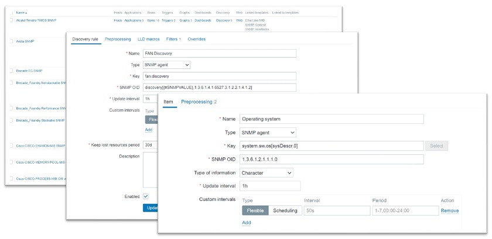

  <p style="text-align:center;">Monitorización de Agentes SNMP con Zabbix</p>

  La mayoría de las veces, la gente utiliza plantillas integradas y comunitarias. Sin embargo, si tienes un conjunto más exótico de entidades en tu entorno, como dispositivos de red, dispositivos de almacenamiento, etc., esto no es suficiente. En su lugar, puedes construir plantillas SNMP personalizadas, que es lo que te guiaremos en este post porque puede ser bastante complicado.

## Creación de plantillas SNMP personalizadas

En primer lugar, la documentación del proveedor es su mejor amigo (si está disponible). Sin la documentación del proveedor, puede llevarte bastante más tiempo crear una plantilla SNMP adecuada. Si la documentación del proveedor es sólida y contiene una lista de los OID y su descripción, te será de gran ayuda.

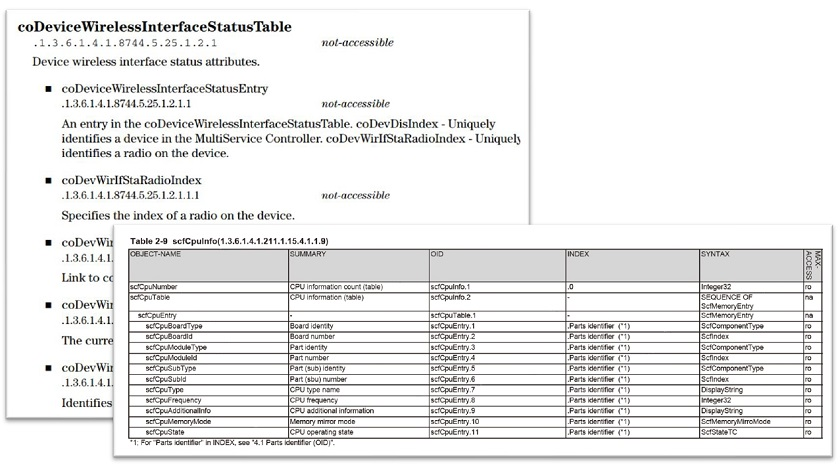

<p style="text-align:center;">Ejemplos extraídos de la documentación del proveedor.</p>

Le recomendamos que se ponga en contacto con su proveedor de hardware para averiguar si puede proporcionarle documentación sobre SNMP, en caso de que no esté disponible públicamente.

No te preocupes si no tienes ese tipo de documentación, ya que aún tienes un par de opciones:

* Podemos buscar archivos MIB específicos de un proveedor. Entonces podemos descargar estos archivos MIB, conectarlos a cualquier navegador MIB, y buscar las métricas que estamos buscando. Esto requerirá algún esfuerzo extra, ya que todavía lleva más tiempo que utilizar la documentación adecuada del proveedor, pero es una buena forma de salir de esa situación. Por lo general, los archivos MIB deberían estar disponibles en una página de descargas pública o se pueden solicitar poniéndose en contacto con el proveedor.

  El problema es que algunos proveedores, en lugar de enviar un conjunto específico de MIBs, tienden a darte sólo 20-100 archivos MIB, y tienes que ir a través de cada uno de ellos en el navegador MIB, lo que puede llevar mucho tiempo. Por suerte, puedes encontrar un navegador MIB con función de búsqueda y buscar simplemente por nombre de métrica: velocidad del ventilador, línea eléctrica, temperatura, etc.
* Las plantillas SNMP listas para usar también pueden utilizarse con MIB de uso general.

### Creación de un entorno de prueba para la plantilla

Antes de enviar nuestra plantilla a producción, es posible que queramos probar una plantilla que hemos creado. ¿Cómo lo haríamos? Podría ser bastante complicado.

* Las plantillas mal configuradas podrían causar un pico de peticiones SNMP en su dispositivo.
* A veces, no se puede acceder directamente al dispositivo durante el desarrollo.

Así, un cliente puede pedirnos que creemos una plantilla, por ejemplo, para un conmutador, una fuente de alimentación o cualquier otro dispositivo que admita SNMP. Normalmente, los clientes no quieren darnos acceso directo a sus dispositivos por motivos de seguridad, lo cual es razonable.

¿Cómo proceder entonces? Podemos crear una plantilla, pero no podemos probarla y no sabemos cómo se comporta el dispositivo en la vida real. Al fin y al cabo, cuando se ponga en marcha, podría ofrecer resultados inesperados debido a índices dinámicos, cambios de configuración u otros comportamientos inesperados específicos del dispositivo.

La forma de solucionar este problema es utilizando **snmpsim**, que está disponible en [GitHub](https://github.com/etingof/snmpsim). **snmpsim** es una herramienta útil y fácil de instalar. Esencialmente puede simular tu dispositivo basándose en la salida del **snmpwalk** de tu dispositivo.

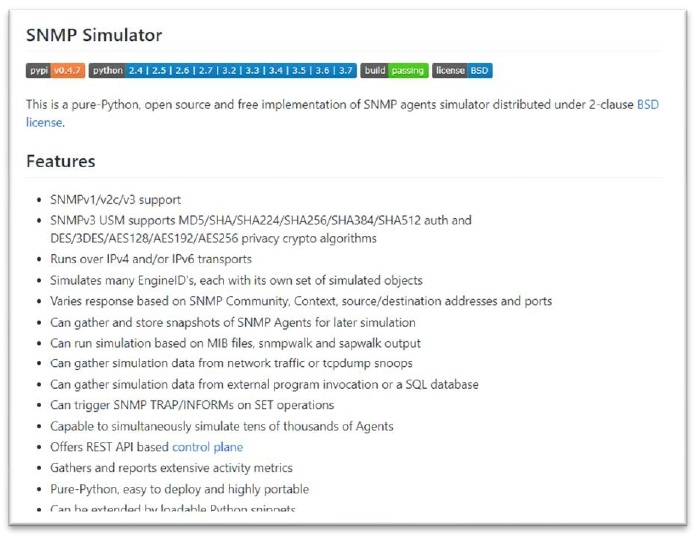

<p style="text-align:center;">SNMP Simulator</p>

### Preparar las herramientas adecuadas

* CentOS 8.
* Zabbix 5.2, nuestra última y mejor versión.
* Documentación de Zabbix (página de descubrimiento SNMP), para que no cometamos ningún error al escribir nuestras propias claves de descubrimiento SNMP, OIDs, etc., y también para tener la sintaxis correcta a mano.
* Software SNMPSIM.
* Salida del comando ****snmpwalk**** de nuestro dispositivo.
* Documentación del proveedor, si podemos conseguirla, que aún se empareja muy bien con el SNMPSIM.
* Archivos MIB del dispositivo, en caso de que la documentación del proveedor cubra las métricas SNMP sólo parcialmente.

### Funcionamiento de **snmpwalk**

* Así que primero ejecutamos un ****snmpwalk**** ya sea desde la raíz del árbol SNMP - .1 o un ****snmpwalk**** restringido comenzando desde un subárbol específico, dependiendo de lo que necesites. En este caso, lo ejecutamos en la raíz del árbol SNMP.

  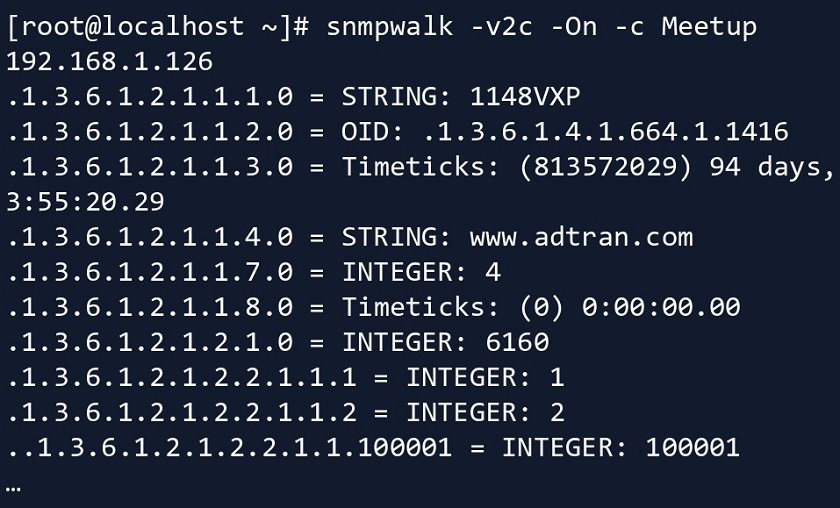

  <p style="text-align:center;">Ejecutar <b>snmpwalk</b> en un dispositivo</p>
* A continuación, almacenamos el resultado en un archivo independiente. En este caso, acabamos con un archivo bastante grande.

## Instalación de SNMPSIM

A continuación, procedemos a configurar **snmpsim**. Aquí tenemos un par de requisitos previos.

* En primer lugar, necesitamos instalar python (python3 en este caso).

  ```bash
  yum install python3
  ```
* A continuación utilizamos pip (instalador de paquetes para Python) para instalar snmpsim.

  ```bash
  pip3 install snmpsim
  ```
* Ten en cuenta que snmpsim no se ejecutará con permisos de usuario elevados, lo que significa que no podremos ejecutarlo como nuestro usuario root. Esto es esencial si te preocupas por la seguridad y en la mayoría de los casos deberías. Para evitar esto creamos un nuevo grupo de usuarios y una cuenta de usuario.

  ```bash
  groupadd snmpd
  ```

  ```bash
  useradd -g snmpd snmpd
  ```
* Luego creamos un directorio bajo ese usuario para colocar allí nuestro archivo ****snmpwalk**** o MIB.

  ```bash
  mkdir -p /usr/share/snmpsim/data
  ```

### Ejecutar snmpsim

* Una vez hecho esto, ejecutamos **snmpsim** y le pasamos la IP/Puerto de escucha. Para ejecutarlo, hemos especificado el endpoint: qué dirección IP, qué interfaz y qué puerto debe escuchar esta instancia de **snmpsim**.

  ```bash
  snmpsimd.py --agent-udpv4-endpoint=192.168.1.126:1024
  ```
* Tienes que tener cuidado si estás ejecutando snmpsim por primera vez, ya que aquí el nombre del archivo **snmpwalk** se convierte en el nombre de la comunidad.

  ```
  Configuring /usr/share/snmpsim/data/192.168.1.126.raw.**snmpwalk** controller
  SNMPv1/2c community name: 192.168.1.126.raw
  SNMPv3 Context Name: 6bdad8c3906f65190f7c5f4674434a6c or 192.168.1.126.raw
  ```

**NOTA**. El nombre de archivo '192.168.1.126.raw' será el nombre de la comunidad.

**NOTA**. En este caso, algunos parámetros están configurados para SNMPv3 para simular un dispositivo SNMPv3.

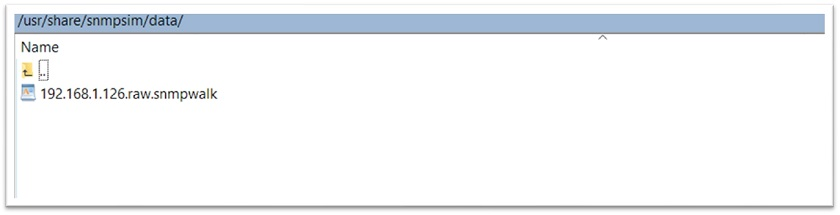

### Probar snmpsim

* Ahora que hemos iniciado **snmpsim** con este archivo **snmpwalk** importado, podemos ejecutar ****snmpwalk**** en el dispositivo simulado, con la comunidad definida por el nombre del archivo.

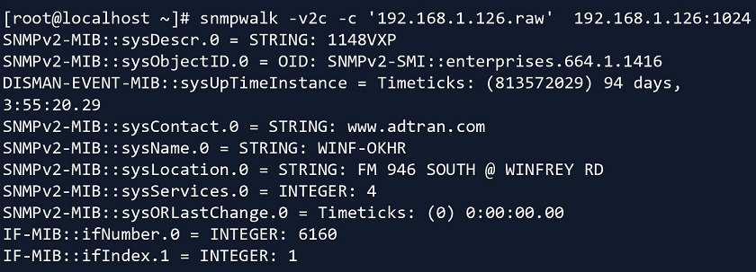

* Especificamos la comunidad, la IP y el puerto adecuados.

  Y ahora podemos ejecutar ****snmpwalk**** en este dispositivo. En la vida real, el cliente o su administrador de red le dará un archivo ****snmpwalk**** del dispositivo original. Entonces, para propósitos de prueba, lo conectas a **snmpsim**, y desde ahí puedes simular el descubrimiento SNMP de Zabbix, sondeo SNMP, etc. Esto evita que el dispositivo tenga problemas de rendimiento al ser bombardeado constantemente por pruebas, peticiones SNMP, etc.

### Probando snmpsim desde Zabbix

Ahora, sabemos que ****snmpwalk**** y **snmpget** funcionan bien, por fin podemos probarlo desde el lado de Zabbix.

* Creamos un host en Zabbix, seleccionamos la versión SNMP, la dirección IP, el puerto (ten cuidado ya que aquí se utiliza el puerto personalizado), y la comunidad (donde la comunidad es el nombre del archivo ****snmpwalk****).

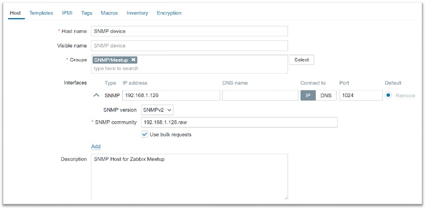

<p style="text-align:center;">Creación de un host en Zabbix</p>

* A continuación, creamos un elemento y especificamos el OID SNMP.

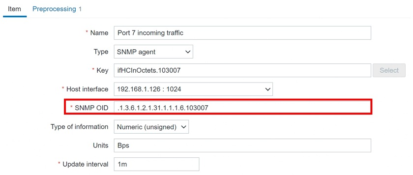

En este punto, el elemento se habilita realmente y puede obtener los datos del dispositivo simulado.

**NOTA**. Aquí sólo vamos a ver datos estáticos basados en la salida de ****snmpwalk****, por lo que seguiremos recibiendo el mismo valor una y otra vez. Aún así, esto significa que el OID con el índice especificado funciona.

### Obtener el formulario OID numérico

Nuestra postura a largo plazo es que los valores numéricos son mejores que las representaciones textuales. Pero, ¿cómo podemos obtener este valor OID numérico si la salida de ****snmpwalk**** es textual?

* En ****snmpwalk****, la salida es textual ('**InOctets**' (octetos entrantes) en este caso).

  ```
  IF-MIB::ifHCInOctets.103007 = Counter64: 7566464822
  IF-MIB::ifHCInOctets.103008 = Counter64: 48097542881
  IF-MIB::ifHCInOctets.103009 = Counter64: 75748849150
  IF-MIB::ifHCInOctets.103010 = Counter64: 25963616931
  ```
* Por lo tanto, utilizamos **snmptranslate** en esta representación textual.

  ```bash
  snmptranslate -On -IR ifHCInOctets
  ```

  ```
  .1.3.6.1.2.1.31.1.1.1.6
  ```
* A continuación, añadimos el índice (103007, pero dependerá del número de puerto) al final del OID.

  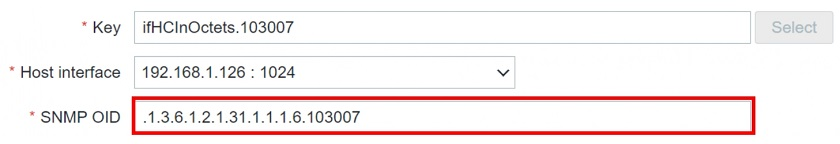

  Y así es como puedes pasar de una representación textual a una numérica utilizando **snmptranslate**. Por supuesto, necesitas tener la MIB específica en la que estás usando **snmptranslate** importada a tu sistema operativo, de lo contrario, no será capaz de hacer la traducción.

### Creación de la regla LLD del Agente SNMP

Crear un elemento es sencillo y directo: basta con abrir la documentación y seguir los pasos que allí se indican. Pero, ¿qué ocurre con la creación de una regla de descubrimiento de bajo nivel? También en este caso las cosas se complican y hay que profundizar un poco más.

* Para empezar, creamos una regla LLD.

  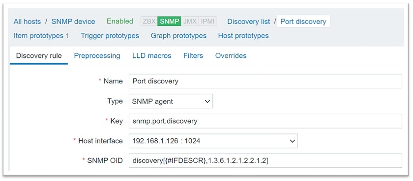

  Aquí, hemos creado una regla de descubrimiento para descubrir todos los índices en este OID - 1.3.6.1.2.1.2.2.1.2 (**IFDescr**). Por supuesto, esto significa que descubriremos todas las descripciones de puertos disponibles.
* A continuación, creamos un prototipo de elemento para el tráfico entrante.

  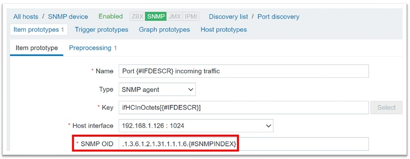

  El prototipo de elemento se rellenará con todos los índices descubiertos de la regla de descubrimiento (el índice descubierto **{#SNMPINDEX}** se añadirá al final del OID **(ifHCInOctets)**. La descripción se introducirá en el nombre y en la clave.

  ### Error ‘No Such Instance currently exists at this OID‘

  Conseguimos que se ejecute el descubrimiento de bajo nivel, pero también obtenemos el mensaje de error de que actualmente no existe tal instancia en este OID. Es posible que se haya encontrado con este error si ha trabajado antes con el descubrimiento SNMP.

  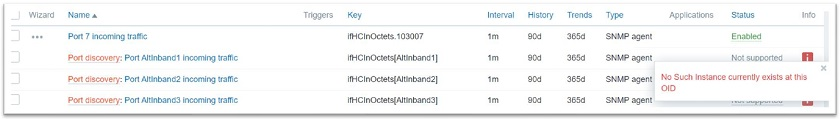


  <p style="text-align:center;">El error No Such Instance currently exists at this OID</p>

Este error es causado por el hecho de que tenemos más índices en **{#IFDESCR}**, el OID que estamos descubriendo, que en el OID que estamos poblando y creando elementos basados en él. Esto significa que intenta crear un elemento con un OID y un índice al final mientras que no tenemos una instancia de OID (un OID con uno o más índices descubiertos al final) para él.

¿Cómo podemos evitarlo? Este error se soluciona filtrando los índices innecesarios mediante **{#IFDESCR}**.

Para ello, tenemos que abrir el archivo ****snmpwalk**** para averiguar para qué índices tenemos octetos entrantes. Una vez que tenemos una lista de índices, podemos filtrar los innecesarios. En este caso, podemos filtrar por '**IfDescr**'. En este caso, estamos filtrando los tipos de interfaz para los que no queremos crear elementos a partir de prototipos, ya que estos elementos no tendrán instancias (índices) en este OID.

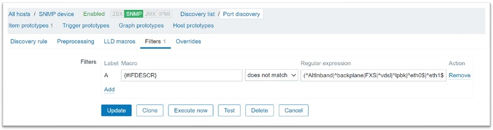

<p style="text-align:center;">Filtrado de índices innecesarios</p>

Con el descubrimiento de bajo nivel el filtrado es siempre tu amigo y puede ahorrarte muchos dolores de cabeza. Eche un vistazo a la salida de ****snmpwalk**** y averigüe qué instancias OID está intentando crear que no existen en realidad, y fíltrelas.

### Filtrado de entidades LLD

Hay un conjunto de filtros comunes que deberíamos utilizar en caso de descubrimiento SNMP para filtrar por entidades específicas, por ejemplo, por tipos de interfaz.

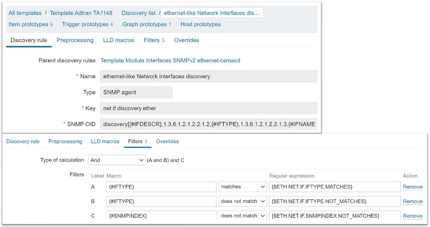

<p style="text-align:center;">Descubrir OID adicionales  <b>(IFTYPE)</b></p>

En este caso, el descubrimiento en sí será un poco más avanzado: descubriremos no sólo las descripciones de las interfaces, sino también sus tipos. Puedes configurar tu descubrimiento para que sólo descubra tipos o nombres de interfaz específicos, o incluso para filtrar algunos índices específicos que podrían causar problemas.

### Error ‘No value received for macro‘

Una vez aplicados los filtros, es posible que reciba un mensaje de error en la propia regla de detección **‘Cannot apply accurately apply filter: no value received for macro “{IfDescr}”‘**.

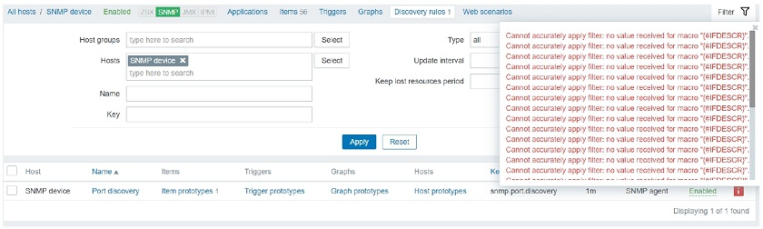

<p style="text-align:center;">Descubrir atributos múltiples - {#IFNAME}, {#IFTYPE}, {#IFDESCR}</p>

¿Qué significa esto? Zabbix intenta aplicar filtros en estas tres macros: **{#IFNAME}**, **{#IFTYPE}** y **{#IFDESCR**}.

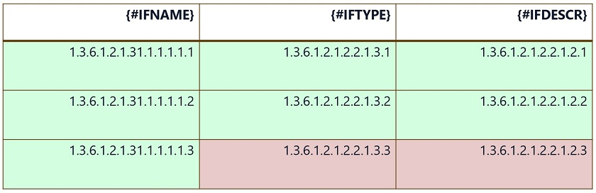

Aquí, el índice .3 no existe para **{#IFTYPE}** y **{#IFDESCR}**. Aún así, Zabbix intenta aplicar filtros a estos índices inexistentes. El mensaje de error significa que no se recibe ningún valor para **{#IFTYPE}** y **{#IFDESCR}** en estos elementos.

Aquí tenemos que ser muy cuidadosos. Por eso tenemos que hacer que nuestras reglas de descubrimiento sean más modulares. Esto puede deberse a que determinados tipos de interfaz no tienen índices de tipo de interfaz ni índices de descripción de interfaz.

¿Cómo podemos solucionar este problema?

### Plantillas modulares y normas LLD

* Tenemos que crear reglas de descubrimiento más modulares o incluso recurrir al uso de plantillas separadas para tipos de interfaz distintos.

  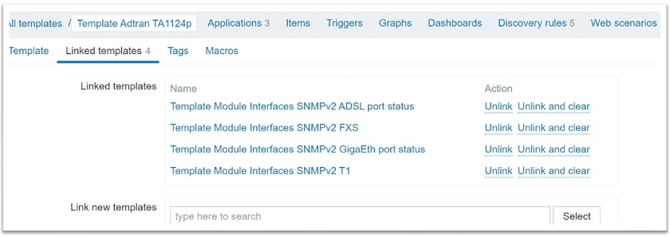

  <p style="text-align:center;">Reglas de detección modulares</p>

  Aquí, tenemos una plantilla padre que tiene cuatro plantillas hijas vinculadas.
* Cada regla de detección se crea para un tipo de interfaz específico. Cada uno de los tipos de interfaz - ADSL, FXS, GigaEth y T1 - utiliza su propio conjunto de filtros muy granulares. En cada una de estas plantillas hemos configurado un filtro de forma que las reglas de detección de bajo nivel nunca intenten aplicar filtros en índices que no existen.
* Esto le permite vincular plantillas secundarias para tipos de entidad específicos a la plantilla principal y desvincularlas según sea necesario, así como activar y desactivar fácilmente reglas de descubrimiento específicas.
* También puede activar/desactivar las reglas de detección a nivel de host.

La idea es no usar una única regla de descubrimiento para todo, especialmente si causa errores en los elementos o en la propia regla de descubrimiento. Sea más granular, eche un vistazo al ****snmpwalk**** y compare sus índices por lo que está intentando filtrar.

## Conclusion

Definitivamente recomendamos echar un vistazo a los ejemplos y mensajes de error anteriores ya que son bastante comunes. Si los ves, haz un análisis del **snmpwalk** de tu dispositivo. Normalmente, es bastante sencillo de resolver una vez que echas un vistazo al **snmpwalk** y empiezas a comparar qué OIDs e índices OID proporciona tu dispositivo. Algunos dispositivos proporcionan índices adecuados para cada OID y esto no será un problema en absoluto, pero otros dispositivos no lo hacen, así que ten cuidado.

Esperamos que este artículo te ayude a simular un dispositivo SNMP en tu propia máquina virtual y a crear reglas de detección de bajo nivel con facilidad. Después de todo, estos ejemplos se crearon en una versión simulada de un dispositivo real.

## Preguntas y respuestas

Respuesta. Digamos que estamos monitorizando nuestros dispositivos SNMP usando un proxy, al que llamamos Proxy A. El Proxy A tiene todas las MIBs necesarias y podemos usar representaciones textuales, ya que sólo podemos usarlas si tenemos las MIBs apropiadas importadas. Entonces, decidimos hacer algún balanceo de carga, o simplemente necesitamos mover nuestro host a un proxy diferente que llamaremos Proxy B. Entonces, los movemos a un proxy diferente, y de repente, estas representaciones textuales ya no son soportadas.

Esto sucedió porque olvidamos mover e importar nuestros archivos MIB al Proxy B. Quizás este procedimiento se hizo hace un par de años, y nuestro nuevo administrador no sabe realmente cómo hacerlo. Por lo tanto, tomará tiempo extra resolver el problema.

Por eso recomendamos utilizar representaciones numéricas. De esta forma, no se olvidará de migrar las MIB cuando migre un host de un proxy a otro. Las representaciones numéricas siempre funcionarán. Son un poco más complejas a simple vista, pero para eso tenemos la clave de elemento, donde puedes proporcionar la descripción de la métrica a la que sirve el OID.

